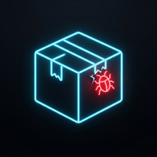
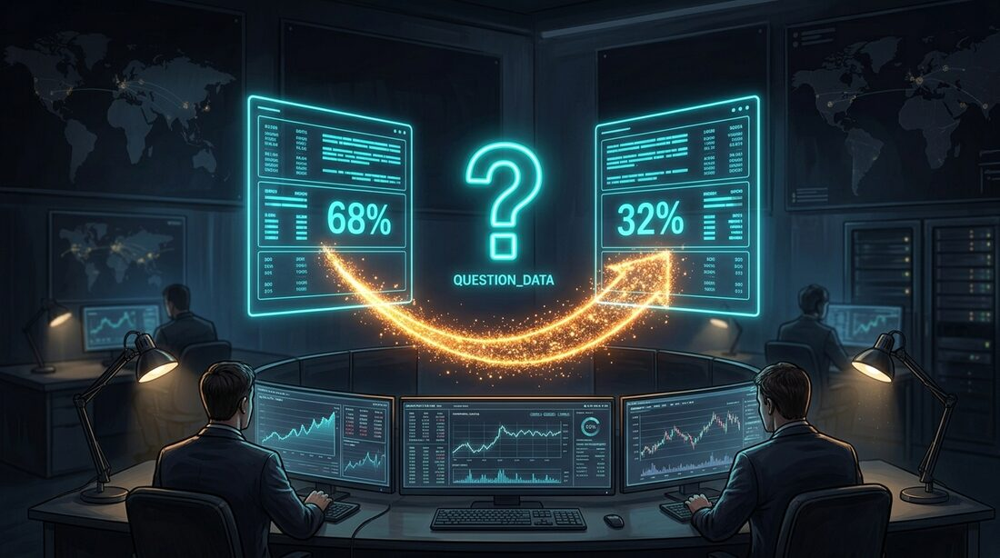
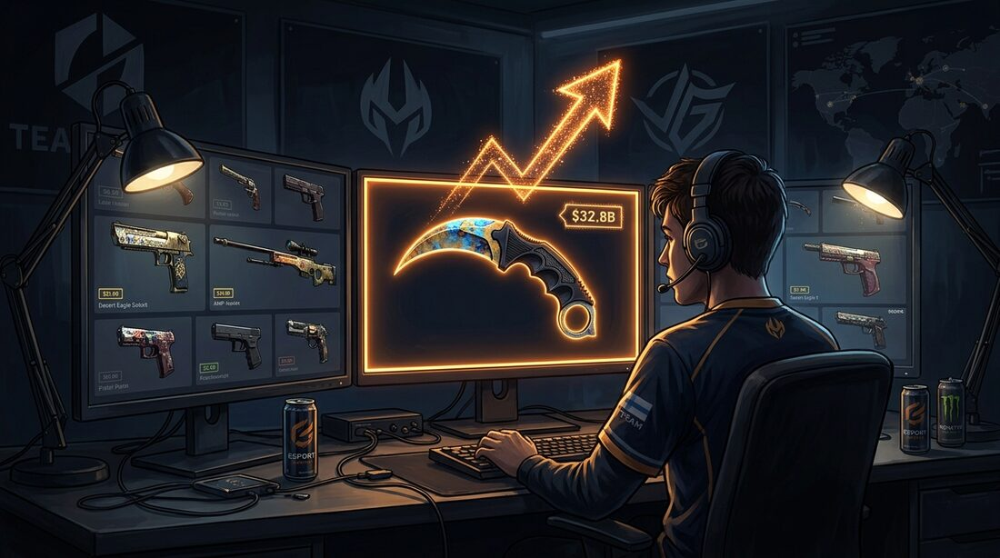

# 0xGollum — Apify Actors

I build **signal feeds** on [Apify](https://apify.com): tools that watch a source non-stop and tell
you *what just changed that's worth acting on* — a price shortening before a race, unusual option
volume landing today, a company that just filed to raise money. Not raw scrapes. Named signals,
small structured datasets, built to run on a schedule.

**▶ All 31 actors on the Apify Store → [apify.com/0xgollum](https://apify.com/0xgollum)**

---

## 📈 Betting &amp; trading signals

| | |
|:--:|:--|
|  | **[The big money already placed its bet today. This shows you which contract.](#unusual-options-activity)** Unusual Options Activity |
|  | **[The same big-money options flow — for BTC and ETH.](#unusual-crypto-options-activity)** Unusual Crypto Options Activity |
|  | **[A shortening price is the oldest tell in racing. Catch it before the off.](#horse-racing-pulse)** Horse Racing Pulse |
|  | **[The same edge, now across nine countries' racing.](#world-turf-pulse)** World Turf Pulse |
|  | **[The line moves before the match does. Be there when it happens.](#soccer-odds-pulse)** Soccer Odds Pulse |
|  | **[Everything Bitcoin is doing right now, in one number.](#bitcoin-pulse)** Bitcoin Pulse |
|  | **[Find the mover before the group chat does — rug-filtered.](#crypto-momentum-detector)** Crypto Momentum Detector |
|  | **[Free-ish money sitting between two exchanges. Stop scanning by hand.](#funding-rate-arbitrage)** Funding Rate Arbitrage |
|  | **[Polymarket says 60. Kalshi says 67. That gap is the trade.](#prediction-market-scanner)** Prediction Market Scanner |
|  | **[The volume that doesn't show on the tape just spiked. Here's where.](#dark-pool-pulse)** Dark Pool Pulse |
|  | **[That skin is about to move. You'll know before you refresh the market.](#cs2-skin-pulse)** CS2 Skin Pulse |
|  | **[Give your AI agent every signal above — no dashboard, just ask.](#signal-hub-mcp)** Signal Hub MCP |

## 🎯 B2B intent &amp; lead generation

| | |
|:--:|:--|
|  | **[They just raised. Their budget just unlocked. Here's who to call.](#funding-intent)** Funding Intent |
|  | **[A new job posting is a budget signal. Watch your accounts for it.](#hiring-intent)** Hiring Intent |
|  | **[They just adopted a new tool. Something adjacent just opened up.](#buying-signal-watcher)** Buying Signal Watcher |
|  | **[One complaint in your reviews just started spiking. Find it first.](#pain-point-finder)** Pain Point Finder |
|  | **[You scraped 500 emails. How many can actually receive mail?](#lead-contact-verifier)** Lead Contact Verifier |
|  | **[One name in. Address history, relatives, aliases and location out.](#skip-tracer)** Skip Tracer |
|  | **[Local businesses with a broken web presence — your next 50 pitches.](#local-lead-opportunity-finder)** Local Lead Opportunity Finder |
|  | **[Their rating is dropping fast. That's your opening to sell the fix.](#local-review-crisis-radar)** Local Review Crisis Radar |
|  | **[Every ad your competitor is running right now, structured.](#meta-ads-competitor-intelligence)** Meta Ads Competitor Intelligence |

## 🛡️ Security &amp; risk monitoring

| | |
|:--:|:--|
|  | **[What a stranger sees when they scan your domain — before they do.](#exploit-radar)** Exploit Radar |
|  | **[The leak site posted a new victim. You'll hear about it today.](#dark-web-breach-sentinel)** Dark Web Breach Sentinel |
|  | **[A poisoned npm package just shipped. Don't let it into your build.](#malicious-package-watch)** Malicious Package Watch |
|  | **[WHO outbreak news, structured — for systems that need it as data.](#outbreak-watch)** Outbreak Watch |

## 🧰 Reliable data scrapers

| | |
|:--:|:--|
|  | **[Only pay for the profiles that actually came back with data.](#reliable-linkedin-profiles)** Reliable LinkedIn Profiles |
|  | **[Empty rows cost you nothing. Only real jobs get billed.](#reliable-linkedin-jobs)** Reliable LinkedIn Jobs |
|  | **[Google Trends data that doesn't silently return nothing.](#reliable-trends-scraper)** Reliable Trends Scraper |
|  | **[LinkedIn, Reed, Talent.com and more — one deduplicated job feed.](#global-job-aggregator)** Global Job Aggregator |
|  | **[Not what's published — what's *accelerating*.](#news-trending-detector)** News Trending Detector |
|  | **[Every brand's tire prices, specs and EU labels in one dataset.](#tire-market-pulse)** Tire Market Pulse |

---

# 📈 Betting &amp; trading signals

## Unusual Options Activity

**The big money already placed its bet today — the question is which contract.**

Feed it a list of tickers and get back the option contracts actually trading *right now* on
abnormal volume: the fresh, directional, size positioning that a raw option chain buries under a
thousand dead strikes. Ranked by how unusual each contract's volume is versus its own baseline, so
the top row is the one that matters.

**→ [See it on the Apify Store](https://apify.com/0xgollum/unusual-options-activity)**

## Unusual Crypto Options Activity

**The same big-money options flow — pointed at BTC and ETH.**

Give it the underlyings and get today's abnormal-volume contracts instead of scrolling a full
chain. Same ranking logic as the equity scanner, crypto venues.

**→ [See it on the Apify Store](https://apify.com/0xgollum/unusual-crypto-options-activity)**

## Horse Racing Pulse

**A shortening price is one of the oldest tells in racing. Catch it before the off.**

Pari-mutuel odds aren't set by a bookmaker — they float with the betting pool right up to post
time. When real money lands on a horse, the price shortens fast, and by the time you've spotted it
on the racecard the move is done. This actor watches every race still open for betting and fires a
**`steamer`** (money coming in) or **`drifter`** (confidence draining) the moment it happens. Opt
in to hidden-form patterns too: first-time runner, long winless streak, race-day jockey change.

**→ [See it on the Apify Store](https://apify.com/0xgollum/horse-racing-pulse)**

## World Turf Pulse

**The same edge, now across nine countries' racing.**

Horse Racing Pulse gone international: Japan, France, UK, Ireland, USA, Australia, Germany, South
Africa, New Zealand. Same steamer/drifter signals, one dataset, all markets.

**→ [See it on the Apify Store](https://apify.com/0xgollum/world-turf-pulse)**

## Soccer Odds Pulse

**The line moves before the match does. Be there when it happens.**

Tracks match-odds movement across books and flags the sharp moves — the ones that usually mean
someone knows something. Snapshot rows plus fired signals, on a schedule.

**→ [See it on the Apify Store](https://apify.com/0xgollum/soccer-odds-pulse)**

## Bitcoin Pulse

**Everything Bitcoin is doing right now, in one number.**

Momentum, leverage, positioning and sentiment, folded into a single pulse score — plus the
components behind it so you can see *why* it moved. Refreshed on a schedule, no dashboard to babysit.

**→ [See it on the Apify Store](https://apify.com/0xgollum/bitcoin-pulse)**

## Crypto Momentum Detector

**Find the mover before the group chat does — with the rugs filtered out.**

Catches tokens early: new launches and accelerating movers, with a built-in anti-rug filter so the
feed isn't wall-to-wall scams.

**→ [See it on the Apify Store](https://apify.com/0xgollum/crypto-momentum-detector)**

## Funding Rate Arbitrage

**Free-ish money sitting between two exchanges. Stop scanning for it by hand.**

Finds funding-rate spreads wide enough to be worth a delta-neutral position, across venues, before
you check them one tab at a time.

**→ [See it on the Apify Store](https://apify.com/0xgollum/funding-rate-arbitrage)**

## Prediction Market Scanner

**Polymarket says 60. Kalshi says 67. That gap is the trade.**

Search any topic and get the live yes/no markets from *both* platforms in one dataset, side by
side, with the price difference already calculated.

**→ [See it on the Apify Store](https://apify.com/0xgollum/prediction-market-scanner)**

## Dark Pool Pulse

**The volume that doesn't show on the tape just spiked. Here's where.**

Scan US tickers and find out when their off-exchange ("dark pool") trading volume jumped, and
which venues drove it.

**→ [See it on the Apify Store](https://apify.com/0xgollum/dark-pool-pulse)**

## CS2 Skin Pulse

**That skin is about to move. You'll know before you refresh the market.**

Catches Counter-Strike 2 skin price momentum — spikes, drops and volume surges — on a schedule.

**→ [See it on the Apify Store](https://apify.com/0xgollum/cs2-skin-pulse)**

## Signal Hub MCP

**Hand your AI agent every signal above — no dashboard, no manual runs.**

An MCP server that pipes the feeds straight into your agent. It just asks for the latest and gets
it.

**→ [See it on the Apify Store](https://apify.com/0xgollum/signal-hub-mcp)**

---

# 🎯 B2B intent &amp; lead generation

## Funding Intent

**They just raised. Their budget just unlocked. Here's who to call.**

Finds companies that just filed to raise private capital — with a real name and title to contact —
while the round is still open and the money is about to be spent.

**→ [See it on the Apify Store](https://apify.com/0xgollum/funding-intent)**

## Hiring Intent

**A new job posting is a budget signal. Watch your target accounts for it.**

Monitors your list of companies' Greenhouse and Lever boards for fresh openings. A company hiring
for a role usually means fresh budget for the tools that role needs — and you're first in the door.

**→ [See it on the Apify Store](https://apify.com/0xgollum/hiring-intent)**

## Buying Signal Watcher

**They just adopted a new tool. Something adjacent just opened up.**

Alerts when a company starts using a new B2B product — a timing signal that a related need is now
live.

**→ [See it on the Apify Store](https://apify.com/0xgollum/buying-signal-watcher)**

## Pain Point Finder

**One complaint in your reviews just started spiking. Find it before it trends.**

Compares an app's recent reviews against its own baseline and surfaces the specific gripe that's
accelerating. No LLM, no API key — just your reviews vs. their history.

**→ [See it on the Apify Store](https://apify.com/0xgollum/pain-point-finder)**

## Lead Contact Verifier

**You scraped 500 emails. How many can actually receive mail?**

Runs a lead list and tells you which addresses sit on a domain that can receive mail
(`mx_confirmed`) and which to bin outright (`no_mx_record`) — before you burn sender reputation on
dead ones.

**→ [See it on the Apify Store](https://apify.com/0xgollum/lead-contact-verifier)**

## Skip Tracer

**One name in. Address history, relatives, aliases and location out.**

Look up a person by name, phone, email or address and get their address history, known relatives,
name variants and location — from public people-search records.

**→ [See it on the Apify Store](https://apify.com/0xgollum/skip-tracer)**

## Local Lead Opportunity Finder

**Local businesses with a broken web presence — your next 50 pitches.**

Finds businesses with a visible, fixable problem: no website, a weak listing, poor SEO. The warm
list for an agency or freelancer.

**→ [See it on the Apify Store](https://apify.com/0xgollum/local-lead-opportunity-finder)**

## Local Review Crisis Radar

**Their rating is dropping fast. That's your opening to sell the fix.**

Flags local businesses whose review score has started sliding — a reputation-management
conversation you can start while it still hurts.

**→ [See it on the Apify Store](https://apify.com/0xgollum/local-review-crisis-radar)**

## Meta Ads Competitor Intelligence

**Every ad your competitor is running right now, structured.**

Pulls a competitor's live creatives, copy and run dates from the Meta Ad Library (Facebook /
Instagram) into a clean dataset.

**→ [See it on the Apify Store](https://apify.com/0xgollum/meta-ads-competitor-intelligence)**

---

# 🛡️ Security &amp; risk monitoring

## Exploit Radar

**What a stranger sees when they scan your domain — before they do.**

Passive, legal attack-surface monitoring: exposed services, known CVEs and common
misconfigurations, on a schedule, so a change in your footprint reaches you and not them first.

**→ [See it on the Apify Store](https://apify.com/0xgollum/exploit-radar)**

## Dark Web Breach Sentinel

**The leak site posted a new victim. You'll hear about it today.**

Watches ransomware-leak and data-breach postings and alerts on new entries as they appear.

**→ [See it on the Apify Store](https://apify.com/0xgollum/dark-web-breach-sentinel)**

## Malicious Package Watch

**A poisoned npm package just shipped. Don't let it into your build.**

A supply-chain early-warning feed: alerts on newly flagged malicious npm and PyPI packages.

**→ [See it on the Apify Store](https://apify.com/0xgollum/malicious-package-watch)**

## Outbreak Watch

**WHO outbreak news, structured — for the systems that need it as data.**

A machine-readable feed of WHO Disease Outbreak News.

**→ [See it on the Apify Store](https://apify.com/0xgollum/outbreak-watch)**

---

# 🧰 Reliable data scrapers

## Reliable LinkedIn Profiles

**Only pay for the profiles that actually came back with data.**

LinkedIn profile data with a hard rule: a record is only pushed to the dataset — and only billed —
if it carries real fields.

**→ [See it on the Apify Store](https://apify.com/0xgollum/reliable-linkedin-profiles)**

## Reliable LinkedIn Jobs

**Empty rows cost you nothing here. Only real jobs get billed.**

Same rule, for LinkedIn jobs: a row is only pushed and billed when it carries real job data, not an
empty shell.

**→ [See it on the Apify Store](https://apify.com/0xgollum/reliable-linkedin-jobs)**

## Reliable Trends Scraper

**Google Trends data that doesn't silently return nothing.**

Trend data you can actually put on a schedule — the empty-result failures that break other trend
scrapers are handled.

**→ [See it on the Apify Store](https://apify.com/0xgollum/reliable-trends-scraper)**

## Global Job Aggregator

**LinkedIn, Reed, Talent.com and more — one deduplicated job feed.**

Every board in one dataset, duplicates merged.

**→ [See it on the Apify Store](https://apify.com/0xgollum/global-job-aggregator)**

## News Trending Detector

**Not what's published — what's *accelerating*.**

Finds stories gaining coverage velocity, so you catch a topic on the way up instead of after it
peaked.

**→ [See it on the Apify Store](https://apify.com/0xgollum/news-trending-detector)**

## Tire Market Pulse

**Every brand's tire prices, specs and EU labels in one dataset.**

Price, specification and EU label data across all brands, structured.

**→ [See it on the Apify Store](https://apify.com/0xgollum/tire-market-pulse)**

---

Built and maintained by <a href="https://apify.com/0xgollum">0xGollum</a> · signals, not spreadsheets · <a href="https://x.com/Gollum0x58577">@Gollum0x58577</a>
